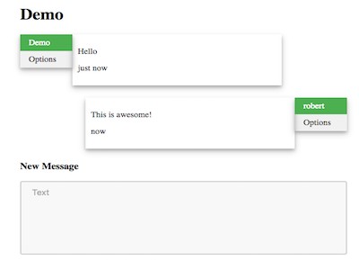

# Conscenery.com

The concept for the website was based on the idea of a simple, lightweight messaging and sharing service without worries of an extensive digital history as each and every message has a set expiry date.

The entire project was coded single-handedly from the ground up with reference to online HTML, CSS, PHP, and SQL documentation. The frontend operation of the website was crafted with modern web design techniques in mind, including comprehensive use of Ajax for content loading, enhanced with the jQuery library. To me, Ajax is about optimization, as the entire page does not need to be reloaded when the overall style is not going to change. The backend operation involved the use of PHP with session cookies for user logins and MySQL tables for User data, Messages, and User-to-user networking respectively.
